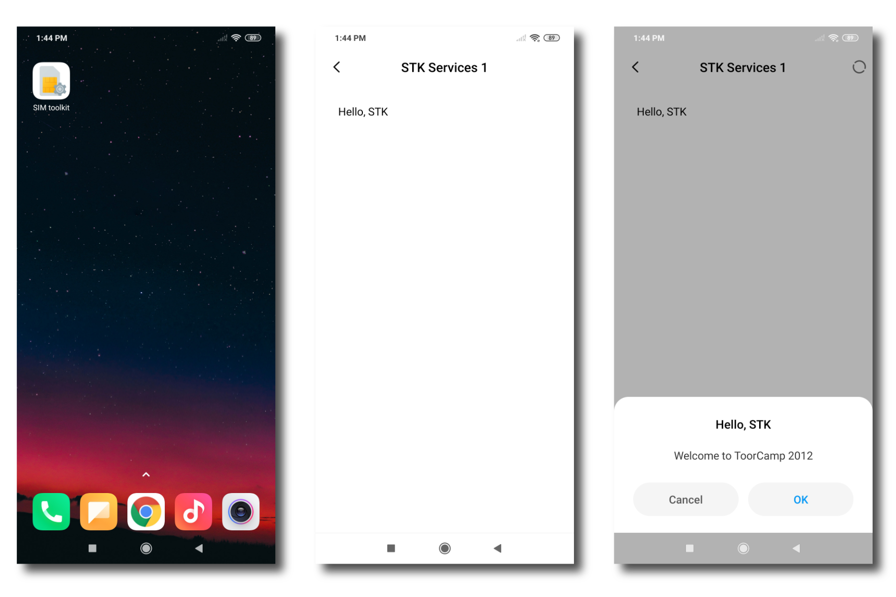

My 2021's guide to [HelloSTK](https://git.osmocom.org/sim/hello-stk/) with two changes:
* no need for ancient Java JDKs: updated [ant-javacard](https://github.com/martinpaljak/ant-javacard) buildchain
* works with sysmoISIM-SJA2

These are just my personal notes, but maybe this "guide" helps you to build and install SIM-Toolkit applets. See here for more information:
* [osmo wiki: sim-toolkit](https://osmocom.org/projects/sim-toolkit/wiki)
* [osmo wiki: shadysim](https://osmocom.org/projects/cellular-infrastructure/wiki/Shadysimpy)
* [osmo wiki: carrier privileges](https://osmocom.org/projects/cellular-infrastructure/wiki/VoLTE_IMS_Android_Carrier_Privileges)

The applet itself is rather simple and just an example:


# Requirements

Tested with:
* sysmoISIM-SJA2
* PCSC card reader
* OpenJDK 11

# Build SIM-Applets
You'll need a Java compiler and `ant`:

```
sudo apt install default-jdk ant
```

Init this repo:
```
git clone https://github.com/mrlnc/HelloSTK2.git
cd HelloSTK2
```

Pull the Javacard SDKs:
```
git submodule update --init --recursive
```

Then run `ant` to build the applet. The output should look like this:
```
$ ant
Buildfile: /home/merlin/HelloSTK2/build.xml

dist:
      [get] Destination already exists (skipping): /home/merlin/HelloSTK2/ant-javacard.jar
      [cap] INFO: using JavaCard 3.0.5 SDK in /home/merlin/HelloSTK2/oracle_javacard_sdks/jc305u3_kit
      [cap] INFO: targeting JavaCard 2.2.1 SDK in /home/merlin/HelloSTK2/oracle_javacard_sdks/jc221_kit
      [cap] INFO: Setting package name to com.github.mrlnc.HelloSTK2
      [cap] Building CAP with 1 applet from package com.github.mrlnc.HelloSTK2 (AID: D07002CA44900101)
      [cap] com.github.mrlnc.HelloSTK2.HelloSTK2 D07002CA44900101
  [compile] Compiling files from /home/merlin/HelloSTK2/src
  [convert] [ INFO: ] Converter [v3.0.5]
  [convert] [ INFO: ]     Copyright (c) 1998, 2018, Oracle and/or its affiliates. All rights reserved.
  [convert]     
  [convert]     
  [convert] [ INFO: ] conversion completed with 0 errors and 0 warnings.
   [verify] Verification passed
      [cap] CAP saved to /home/merlin/HelloSTK2/bin/HelloSTK2.cap

BUILD SUCCESSFUL
Total time: 1 second
```

I've added my resulting binary, just keep in mind that you'll need a compatible SIM: 

# Install

Some guides tell you to use [GlobalPlatformPro](https://github.com/martinpaljak/GlobalPlatformPro#get-it-now) or `sim-tools` by shadysim.

However:
* GlobalPlatformPro works for javacard applets, but our SIM applets are a bit special.
* SIM-Applets require additional OTA security
* this has been added to a **fork** of sim-tools *but not the original tool*.

Download the `sim-tools` fork by @herlesupreeth:

```
git clone https://github.com/herlesupreeth/sim-tools.git
```

Dependencies:
```
pip2 install --user pycrypto pyscard
```

Then load and install the applet. Make sure you insert `KIC1` and `KID1`. I think you might brick your card if you fail the authentication too many times. Don't skip any parameter. It's intentional to have load and install separate.


```
python2 ./sim-tools/shadysim/shadysim_isim.py --pcsc \
      -l ./HelloSTK2/bin/HelloSTK2.cap \
      -i ./HelloSTK2/bin/HelloSTK2.cap \
      --kic XXX
      --kid XXX
      --instance-aid d07002CA44900101
      --module-aid d07002CA44900101
      --nonvolatile-memory-required 00ff
      --volatile-memory-for-install 00ff
      --enable-sim-toolkit
      --max-menu-entry-text 15
      --max-menu-entries 02
```

## Common Errors

- wrong KIC, KID (note to myself: double-check)
- applets cannot be updated. you need to delete, then re-install. common error code in this case: `6985`
- `shadysim_isim` requires `pyscard==1.9.9`

# Uninstall

Use `shadysim_isim.py` with the flag `--list-applets`:
```
$ python2 shadysim/shadysim_isim.py --pcsc --kic xxx --kid xxx --list-applets
AID: a0000000620001, State: 01, Privs: 00
AID: 4a6176656c696e2e6a637265, State: 01, Privs: 00
AID: a0000000620101, State: 01, Privs: 00
AID: a0000000620102, State: 01, Privs: 00
AID: a0000000620201, State: 01, Privs: 00
AID: a000000062020801, State: 01, Privs: 00
AID: a00000006202080101, State: 01, Privs: 00
AID: a0000000620002, State: 01, Privs: 00
AID: a0000000620003, State: 01, Privs: 00
AID: a000000062010101, State: 01, Privs: 00
AID: a00000015100, State: 01, Privs: 00
AID: a0000000090005ffffffff8911000000, State: 01, Privs: 00
AID: a0000000090005ffffffff8912000000, State: 01, Privs: 00
AID: a0000000090005ffffffff8913000000, State: 01, Privs: 00
AID: a0000000090005ffffffff8911010000, State: 01, Privs: 00
AID: a0000000871005ffffffff8913100000, State: 01, Privs: 00
AID: a0000000871005ffffffff8913200000, State: 01, Privs: 00
AID: a0000000090003ffffffff8910710001, State: 01, Privs: 00
AID: a0000000090003ffffffff8910710002, State: 01, Privs: 00
AID: a0000000090005ffffffff8915000000, State: 01, Privs: 00
AID: a00000015141434c, State: 01, Privs: 00
	Instance AID: a00000015141434c00
AID: d001935711, State: 01, Privs: 00
	Instance AID: d001935711fa7b01
AID: d07002ca44, State: 01, Privs: 00
	Instance AID: d07002ca44900101
```

Note the AID `d07002ca44` for the Instance AID: `d07002ca44900101` that we just installed. We can use the AID to uninstall the applet:

```
$ python2 shadysim/shadysim_isim.py --pcsc --kic xxx --kid xxx -d d07002ca44
```

# Config

In `build.xml`, set `targetsdk` to the version that is supported by your javacard.
For sysmoISIM-SJA2, use JC 2.2.1:
```
targetsdk="oracle_javacard_sdks/jc221_kit"
```

Maybe, `aid` needs to match the AIDs during installation 🤷🏼‍♂️
```
<applet class="com.github.mrlnc.HelloSTK2.HelloSTK2" aid="d0:70:02:CA:44:90:01:01">
```

# Old Buildchain: Issues

Some keywords for people googling for hours like crazy without success, just like me 💫

- [sim-tools](https://github.com/Shadytel/sim-tools) targets versions that aren’t supported by JDK anymore
```
error: Source option 1.3 is no longer supported. Use 6 or later.
error: Target option 1.1 is no longer supported. Use 1.6 or later.
```
- The converter.jar (Java Card 2.2.1 Class File Converter) isn’t happy when changing the target to 1.6:
```
error: org.toorcamp.HelloSTK.HelloSTK: unsupported class file format of version 50.0.
```

The key is that ant-javacard uses a new SDK to generate CAPs compatible to the old SDK:
```
targetsdk="oracle_javacard_sdks/jc221_kit" jckit="oracle_javacard_sdks/jc305u3_kit" 
```

# Credits

* the `sim` library comes from [3GPP TS43.019](http://www.3gpp.org/ftp/Specs/archive/43_series/43.019/43019-560.zip), see [this Stack Overflow comment](https://stackoverflow.com/a/22471187)
* [HelloSTK](https://git.osmocom.org/sim/hello-stk/)
* [ant-javacard](https://github.com/martinpaljak/ant-javacard)
* [oracle_javacard_sdks](https://github.com/martinpaljak/oracle_javacard_sdks)